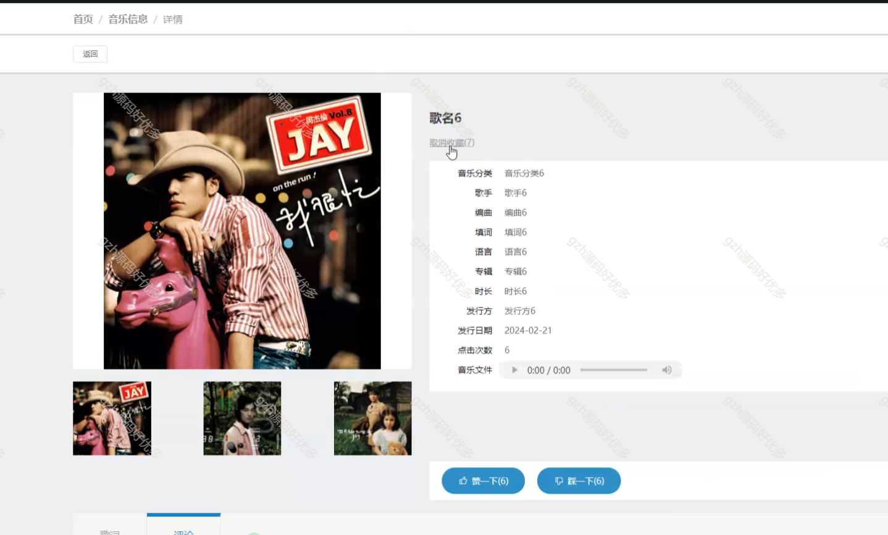
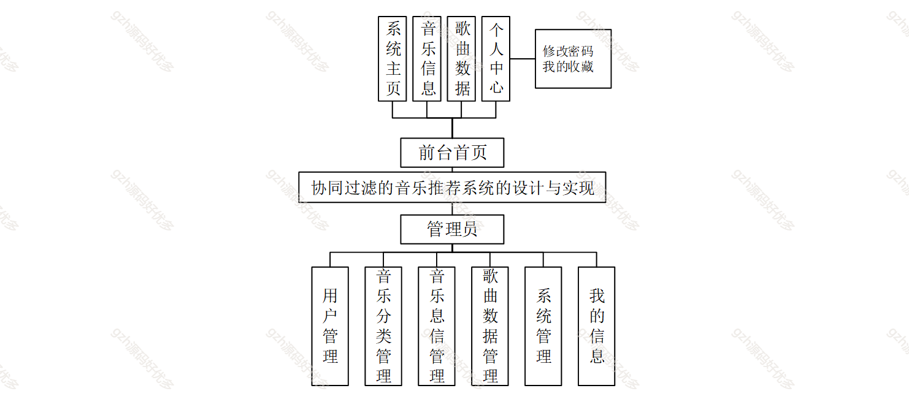
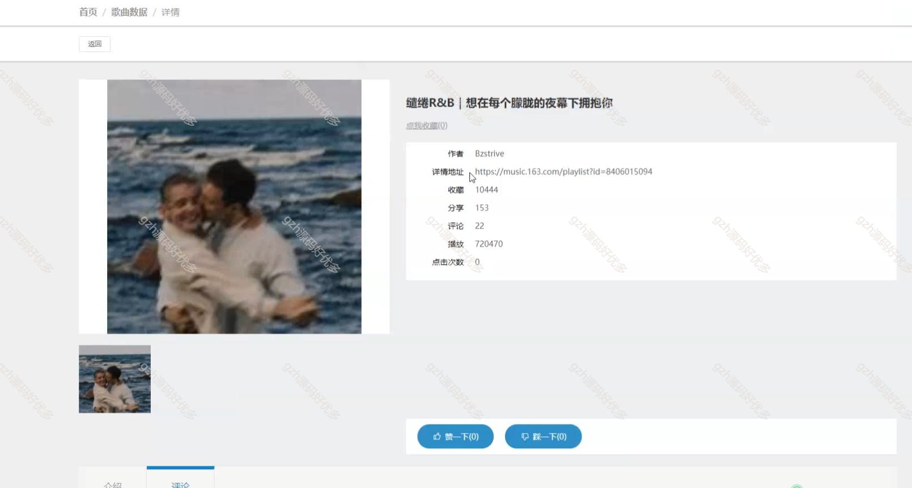
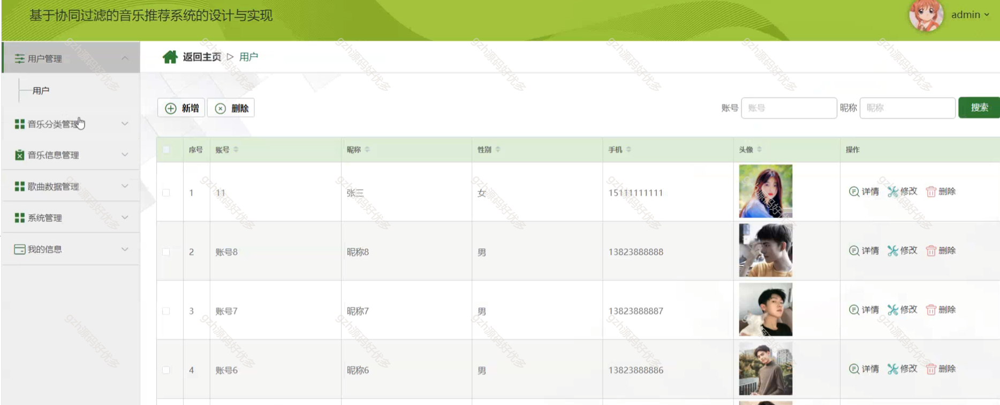
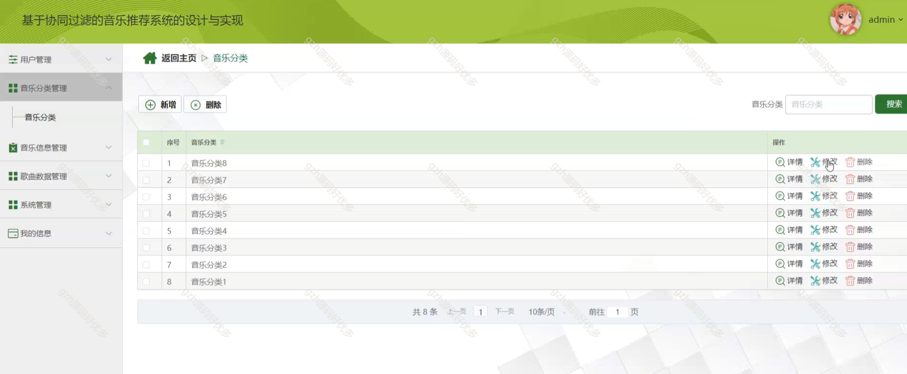
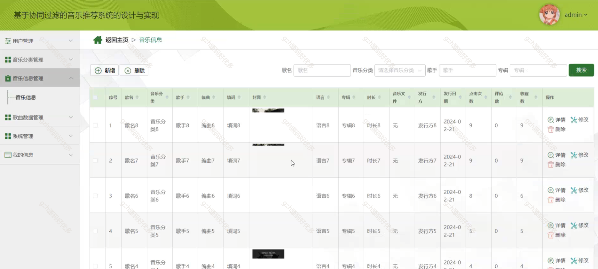
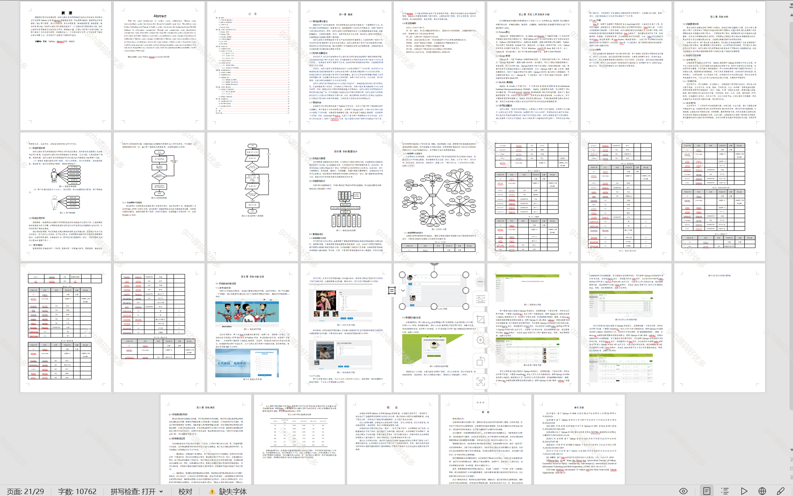

# python007
python007基于Python的协同过滤音乐推荐系统
 
## 查看主页获取源码

### 一、关键词
基于协同算法的音乐推荐系统、音乐播放系统、音乐推荐系统、个性化音乐推荐系统

 

### 二、作品包含

源码+数据库+设计文档万字+PPT+全套环境和工具资源+部署教程

 

### 三、项目技术

前端技术：Html、Css、Js、Vue2.0、Element-ui
后端技术：Python3.7、Django2.0

  

 

### 四、运行环境（以下版本亲测，其他版本未知，请自测）

开发工具：PyCharm + VSCODE

数据库：MySQL5.7（最低要5.7版本）

数据库管理工具：Navicat10+

Python：Python3.7

前端Nodejs：14

浏览器：谷歌浏览器

 

### 五、项目介绍

项目编号：python007

随着现代音乐的快速发展，协同过滤的音乐推荐系统已成为人们业余生活的需求

通过用户管理、音乐分类管理、音乐信息管理、歌曲数据管理、系统管理、我的信息等功能，为协同过滤的音乐管理员提供了一个全面的音乐管理解决方案

 

### 六、运行截图

